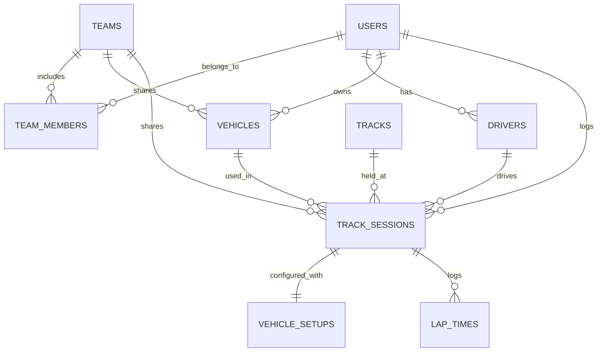

# MyLapLog - 통합 개발 기획 및 v0.8 구현 명세서 (App Specifications & Dev Report)

## 1. 프로젝트 및 릴리즈 개요 (Project & Release Overview)

### (1) 서비스 개요 (Service Overview)
- **서비스명**: **MyLapLog (마이랩로그)**
- **서비스 목적**: 서킷 트랙데이 및 모터스포츠 레이스 드라이버를 위한 **팀/드라이버/차량 등록, 세션별 머신 셋업값 로깅, 팀원 간 셋업 데이터 공유, 랩타임 분석 및 셋업-성능 상관관계 추적 플랫폼**

- **호스팅 도메인**: 
  - 랜딩/홍보: `https://mylaplog.com`, `https://www.mylaplog.com`
  - 웹 애플리케이션: `https://app.mylaplog.com` (또는 `https://mylaplog.com/app/`)
- **서버 인프라**: AWS Lightsail Debian 12 LAMP (Apache2, MariaDB 10.11, PHP 8.2+)

### (2) 릴리즈 정보 (Release Info)
- **릴리즈 버전**: `v0.8.0 (Preview / Client Core Release)`
- **작성일자**: 2026-08-25
- **개발 산출물 경로**:
  - **웹 앱 소스**: [html/mylaplog/app/index.html](file:///c:/Users/tiziy/Documents/Antigravity/lightsail_lamp/html/mylaplog/app/index.html)
  - **홍보 랜딩 페이지**: [html/mylaplog/index.html](file:///c:/Users/tiziy/Documents/Antigravity/lightsail_lamp/html/mylaplog/index.html)
  - **통합 명세 및 개발 문서**: [mylaplog_app_spec_dev_v0.8.md](file:///c:/Users/tiziy/Documents/Antigravity/lightsail_lamp/mylaplog_app_spec_dev_v0.8.md)

---

## 2. 개발 아키텍처 및 디자인 시스템 (Architecture & Design)

```
[ Layout Structure ]
┌─────────────────┬────────────────────────────────────────────────────────┐
│  Sidebar        │  Topbar (Page Title, Quick Action Modals)              │
│  - Logo         │  [ 팀 등록 | 팀 가입 | 머신 등록 | 세션 로깅 | 로그인 ] │
│  - Team Switch  ├────────────────────────────────────────────────────────┤
│  - 6 Main Tabs  │  Active Tab Panel                                      │
│  - User Profile │  [Dashboard | Sessions | Garage | Analytics | Team...] │
└─────────────────┴────────────────────────────────────────────────────────┘
```

- **프론트엔드 스택**:
  - **Core**: Vanilla HTML5 + Modern JavaScript (ES6+ SPA 구조)
  - **Styling**: Vanilla CSS3 (Custom Design System, 다크 레이싱 테마, 글래스모피즘)
  - **시각화 엔진**: Chart.js (텔레메트리 셋업-랩타임 상관관계 라인 차트)
  - **아이콘**: Lucide Icons (CDN)
  - **타이포그래피**: Google Fonts (`Chakra Petch`, `Orbitron`, `Noto Sans KR`)
- **데이터 스토리지 아키텍처 (Zero LocalStorage, 100% MariaDB Backend)**:
  - 브라우저의 `localStorage` 또는 `sessionStorage`를 통한 로컬 캐싱을 완전히 배제하고, **모든 데이터(유저 인증, 차량, 세션, 셋업, 팀, 리더보드)는 MariaDB 10.11 REST API를 통해 실시간 생성/조회/수정/삭제**됩니다.
  - 앱 구동(`initApp`) 시 기존 브라우저 로컬 스토리지를 자동 클리어(`localStorage.clear()`)하여 과거 캐시 잔여물을 차단합니다.
  - **게스트 모드 (로그아웃 상태)**: 비로그인 사용자의 체험을 위한 읽기 전용 인메모리 샘플 데이터(`SAMPLE_GARAGE`, `SAMPLE_SESSIONS`, `SAMPLE_TEAM`) 표시
  - **로그인 모드 (인증 상태)**: PHP PDO 세션 인증 기반으로 MariaDB에서 해당 로그인 유저의 레코드만 안전하게 쿼리하여 렌더링
  - **대시보드 메트릭스 & 하이라이트 배너**: DB에 저장된 실제 세션/차량/팀 데이터에 기반하여 실시간 동적 계산 및 Empty State UI 완벽 지원

---

## 3. 핵심 기능 요구사항 및 프로세스 (Core Features & Flow)

```
[ 팀 생성 & 멤버 초대 ] ──> [ 드라이버 & 차량 등록 ] ──> [ 트랙데이 세션 생성 ] ──> [ 머신 셋업 로깅 ] ──> [ 랩타임 기록 & 분석 ]
                                                                                             │
                                                                                             └──> [ 팀원 간 셋업/데이터 공유 & AI 인사이트 ]
```

### (1) 유저 & 드라이버 및 팀 관리 (User, Driver & Team Management)
- **회원가입 / 로그인**: 이메일, 간편 소셜 로그인 (Google, Apple, Kakao 모의 연동)
- **드라이버 프로필 모달 (Driver Profile Modal)**:
  - **로그인 상태**: 상단 로그인 버튼 및 사이드바 프로필 클릭 시 **해당 로그인 드라이버의 상세 정보 모달**(아바타, 이름, 이메일, 출전 클래스, KARA 라이선스, 소속 팀, 등록 머신 수, 총 주행 세션 수, 계정 상태) 노출 및 원클릭 로그아웃 지원
  - **로그아웃(게스트) 상태**: 클릭 시 로그인/회원가입 모달 노출
- **레이싱 팀/크루 관리**:
  - 팀 생성 및 고유 초대 코드/링크 기반 팀원 가입
  - 팀 내 역할 및 권한 관리: 팀장(Chief), 매니저(Manager), 드라이버(Driver), 미캐닉/엔지니어(Mechanic), 뷰어(Viewer)

### (2) 개러지 (차량 등록 및 관리)
- **차량 기본 정보**: 제조사, 모델명, 연식, 구동방식 (FF/FR/AWD/MR), 트랜스미션 (수동/DCT/시퀀셜)
- **엔진 & 파워트레인**: 마력(hp), 토크(kg.m), ECU 맵핑 상태, 흡배기 튜닝
- **하체 & 서스펜션 스펙**: 서스펜션 브랜드, 스프링 레이트(F/R kgf/mm), 조절단수
- **타이어 & 휠**: 휠 사이즈, 타이어 모델(Sur4G, V730, Trofeo R 등), 단면폭(F/R mm)
- **브레이크 & 에어로**: 브레이크 캘리퍼/패드 모델, 리어 윙/프론트 스플리터 유무

### (3) 트랙데이 세션 및 머신 셋업 로깅 (Core Log Engine)
- **이벤트 정보**: 방문 서킷 (인제 스피디움, 영암 KIC, 용인 에버랜드 스피드웨이, 태백 모터파크 등), 주행 일자, 주최사
- **기상/트랙 환경**: 기온(°C), 노면온도(Track Temp °C), 습도, 기압, 날씨(Dry/Damp/Wet)
- **세션별 셋업 파라미터 (Session Setups)**:
  - **타이어 공기압**: 주행 전 냉간(Cold PSI) / 주행 직후 열간(Hot PSI) (FL, FR, RL, RR 4륜 개별)
  - **댐퍼 감쇠력**: Bump / Rebound 또는 통합 클릭 수 (F / R Clicks)
  - **얼라인먼트**: 네거티브 캠버각(F/R ° 4륜 개별), 토우각(Toe In/Out mm 4륜 개별), 캐스터각(F/R ° 4륜 개별)
  - **스웨이바 / 스태빌라이저**: 강도 세팅 (Soft / Mid / Hard)
  - **에어로 파츠**: 리어 윙 앵글(Angle of Attack, °), 프론트 댐퍼 스트로크
  - **기타**: 연료 잔여량(L / %), 타이어 트레드 잔여 깊이(mm), 브레이크 잔량

### (4) 랩타임 & 섹터 분석 (Lap Times)
- **랩타임 수집**: 세션별 Best Lap, 세부 랩(Lap 1 ~ N), In/Out 랩 구분
- **섹터 분할**: Sector 1, Sector 2, Sector 3 구간 타임 기록
- **이론상 최적 랩 (Optimal Lap)**: 각 세션의 최고 섹터 조합 자동 계산
- **일관성 지수 (Consistency Index)**: 랩타임 편차 분석

### (5) 팀 데이터 공유 & 셋업 상관관계 피드백 (Team Sharing & Setup Intelligence)
- **팀 내 데이터 공유 (Data Sharing)**:
  - 같은 팀 멤버 간 차량 개러지 스펙, 세션별 세팅값(공기압/감쇠력/캠버 등), 랩타임 및 드라이버 피드백 실시간 열람/공유
  - 공개 범위 설정: 비공개(Private), 팀 전체 공유(Team Shared), 전체 공개(Public)
  - 팀원 간 세션 셋업 비교 (예: 동일 차종/서킷에서 팀원 A vs 팀원 B의 공기압/감쇠력 셋업 및 랩타임 비교)
- **셋업 vs 랩타임 상관관계 피드백**:
  - 셋팅값 변경에 따른 랩타임 증감 추세 분석 (예: 공기압 2psi 인하 시 0.4초 단축)
  - 드라이버 피드백 노트 (언더스티어/오버스티어 경향, 브레이크 페이드, 연석 추종성 등)

---

## 4. v0.8 구현 완료 화면 및 기능 명세 (Implemented Features in v0.8)

### (1) 👤 유저 인증 및 프로필 관리 (`Auth System`)
- **로그인 / 회원가입 모달 (`Auth Modal`)**:
  - 로그인: 이메일/비밀번호 인증 및 간편 소셜 로그인 (Google, Apple, Kakao 모의 연동)
  - 회원가입: 드라이버 닉네임/본명, 이메일, 비밀번호, 주 출전 클래스(`PRO-AM`, `Clubman`, `Expert`, `Rookie`), KARA 라이선스 등급 선택
- **동적 프로필 연동**: 로그인/가입 완료 시 사이드바 및 세션 로거 작성자 정보 실시간 동기화
- **로그아웃 지원**

### (2) 🛡️ 레이싱 팀 허브 & 등록 관리 (`Team Hub`)
- **팀 등록 및 생성 (`Create Team Modal`)**: 팀명, 연고 서킷, 팀 슬로건 입력 시 고유 초대 코드 자동 생성
- **팀 가입 (`Join Team Modal`)**: 초대 코드(`APEX-KOR-2026` 등) 입력 및 역할(`Driver`, `Mechanic`, `Viewer`) 선택 후 즉시 가입
- **팀 프로필 & 초대 코드 시스템**: 초대 코드 원클릭 복사 및 실시간 팀원 목록/권한 동기화
- **팀원 목록 및 역할 관리**:
  - `Team Owner` (팀장)
  - `Driver` (드라이버)
  - `Mechanic` (수석 미캐닉)

### (3) 🏁 드라이버 대시보드 (`Dashboard`)
- **실시간 핵심 메트릭스 카드**:
  - 총 주행 세션수 (18 Sessions)
  - 서킷별 베스트 랩타임 (인제 스피디움 `01:52.348`, -0.42s PB)
  - 등록 개러지 머신수 (2대)
  - 소속 레이싱 팀 상태 (`Apex Racing Korea`, 6명)
- **세션 하이라이트 배너**: 최근 트랙데이 베스트 랩, S1/S2/S3 섹터 타임 및 주요 셋업 요약 표시
- **최근 세션 피드**: 최근 등록된 셋업 및 랩타임 카드 렌더링

### (4) ⚙️ 세션 & 머신 셋업 로거 (`Sessions / Setup Logger`)
- **세션 로그 목록 조회**: 서킷명, 일자, 세션 번호, 출전 머신, 베스트 랩타임
- **4륜 타이어 열간 공기압(Hot PSI) 시각화**: FL / FR / RL / RR 개별 수치 박스 제공
- **하체 셋업 파라미터**: 댐퍼 감쇠력(F/R Clicks), 프론트 캠버 각도(°), 드라이버 피드백 메모
- **신규 세션 등록 모달 (`Modal`)**:
  - 서킷 선택 (인제, 영암, 용인, 태백)
  - 개러지 등록 머신 선택 연동
  - 4륜 PSI, 댐퍼 클릭수, 캠버, 엔지니어링 메모 저장

### (5) 🏎️ 개러지 머신 관리 (`Garage`)
- **머신 스펙 카드**: 제조사, 모델, 연식, 엔진 마력(hp), 장착 타이어 모델, 하체 서스펜션 사양
- **공개 범위 태그**: `TEAM` (팀원 공유), `PUBLIC` (전체 공개), `PRIVATE` (나만 보기)
- **신규 머신 등록 모달 (`Modal`)**: 제조사, 모델명, 마력, 타이어 규격 등 입력 지원

### (6) 📊 텔레메트리 & 셋업 비교 분석 (`Analytics`)
- **셋업 vs 랩타임 상관관계 차트 (Chart.js)**:
  - 타이어 열간 공기압(PSI) 변화(36 -> 35 -> 34 -> 32.5 -> 38)에 따른 랩타임 증감 추세 분석
  - 공기압 최적점(34 PSI) 도달 시 베스트 랩타임 시각화
- **팀원 간 셋업 비교 매트릭스 (`Teammate Setup Comparison`)**:
  - 동일 서킷/차종에서 `Alex Kim (#77)` vs `David Lee (#12)` 셋업 비교
  - 베스트 랩타임 델타(-0.772s), 타이어 공기압 차이, 댐퍼 클릭수, 캠버 각도, 리어 윙 각도 비교 및 피드백

### (7) 🏆 서킷 랭킹 리더보드 (`Leaderboard`)
- 서킷별 (인제, 영암, 용인) 공식 랩타임 랭킹 순위표
- 드라이버명, 차종, 소속 팀, 베스트 랩타임, 타이어 모델, 세팅 요약 정보 열람

---

## 5. 데이터베이스 설계안 (Database Schema Draft)



### 주요 테이블 명세

#### 1) `users` (회원 테이블)
- `id` (BIGINT PK AUTO_INCREMENT)
- `email` (VARCHAR(191) UNIQUE)
- `password_hash` (VARCHAR(255))
- `name` (VARCHAR(100))
- `created_at` (DATETIME)

#### 2) `teams` (레이싱 팀/크루 테이블)
- `id` (BIGINT PK AUTO_INCREMENT)
- `name` (VARCHAR(100)) - 팀명
- `invite_code` (VARCHAR(32) UNIQUE) - 팀 초대 코드
- `owner_id` (BIGINT FK) - 팀 소유자/팀장 user_id
- `description` (TEXT) - 팀 소개
- `created_at` (DATETIME)

#### 3) `team_members` (팀 소속 멤버 및 권한)
- `id` (BIGINT PK AUTO_INCREMENT)
- `team_id` (BIGINT FK) - 소속 팀 ID
- `user_id` (BIGINT FK) - 회원 ID
- `role` (VARCHAR(20)) - OWNER, MANAGER, DRIVER, MECHANIC, VIEWER
- `can_view_data` (TINYINT(1) DEFAULT 1) - 팀 데이터 열람 권한
- `can_edit_data` (TINYINT(1) DEFAULT 0) - 팀 세션/셋업 편집 권한
- `joined_at` (DATETIME)
 
#### 4) `vehicles` (차량 개러지)
- `id` (BIGINT PK)
- `user_id` (BIGINT FK) - 소유자 ID
- `team_id` (BIGINT FK NULLABLE) - 소속 팀 ID (팀 내 차량 공유)
- `make` (VARCHAR(50)) - 예: Hyundai, Porsche, BMW
- `model` (VARCHAR(100)) - 예: Avante N, 911 GT3, M2
- `year` (INT)
- `engine_power` (INT) - 엔진 최고 출력 / 마력(hp) (예: 280)
- `tire_model` (VARCHAR(100)) - 예: Sur4G, V730, Trofeo R
- `tire_size_front` / `tire_size_rear` (VARCHAR(50))
- `suspension_spec` (TEXT)
- `visibility` (VARCHAR(20) DEFAULT 'TEAM') - PRIVATE(나만 보기), TEAM(팀원 공유), PUBLIC(전체 공개)
- `is_active` (TINYINT(1))

#### 5) `tracks` (서킷 메타데이터)
- `id` (INT PK)
- `name` (VARCHAR(100)) - 예: 인제 스피디움, 영암 KIC
- `layout_name` (VARCHAR(50)) - Full, Short, F1 Course
- `length_meters` (INT)
- `sector_count` (INT DEFAULT 3)

#### 6) `track_sessions` (세션 정보)
- `id` (BIGINT PK)
- `user_id` (BIGINT FK) - 주행 드라이버 ID
- `team_id` (BIGINT FK NULLABLE) - 소속 팀 ID (팀 내 데이터 공유)
- `vehicle_id` (BIGINT FK)
- `track_id` (INT FK)
- `session_date` (DATE)
- `session_number` (INT) - Session 1, 2, 3...
- `air_temp` (DECIMAL(4,1))
- `track_temp` (DECIMAL(4,1))
- `weather_condition` (VARCHAR(50)) - DRY, WET, DAMP
- `visibility` (VARCHAR(20) DEFAULT 'TEAM') - PRIVATE(나만 보기), TEAM(팀원 공유), PUBLIC(전체 공개)

#### 7) `vehicle_setups` (세션별 셋팅값)
- `id` (BIGINT PK)
- `session_id` (BIGINT FK UNIQUE)
- `cold_psi_fl`, `cold_psi_fr`, `cold_psi_rl`, `cold_psi_rr` (DECIMAL(4,1))
- `hot_psi_fl`, `hot_psi_fr`, `hot_psi_rl`, `hot_psi_rr` (DECIMAL(4,1))
- `damper_front_clicks`, `damper_rear_clicks` (INT)
- `camber_front`, `camber_rear` (DECIMAL(3,1))
- `wing_angle_deg` (DECIMAL(3,1))
- `fuel_liters` (DECIMAL(4,1))
- `driver_notes` (TEXT)

#### 8) `lap_times` (랩타임)
- `id` (BIGINT PK)
- `session_id` (BIGINT FK)
- `lap_number` (INT)
- `lap_time_ms` (INT) - 밀리초 단위 (예: 112348 -> 01:52.348)
- `is_valid` (TINYINT(1) DEFAULT 1)
- `is_best` (TINYINT(1) DEFAULT 0)

---

## 6. 인프라 및 파일 경로 매핑 (Infrastructure Mapping)

| 구분 | 서버 실제 경로 | 접속 URL | 설명 |
| :--- | :--- | :--- | :--- |
| **웹 앱 포털** | `/var/www/html/mylaplog/app/index.html` | `https://app.mylaplog.com`<br>`https://mylaplog.com/app/` | MyLapLog 웹 애플리케이션 (`v0.8.0`) |
| **REST API** | `/var/www/html/mylaplog/app/api.php` | `https://app.mylaplog.com/api/*` | PHP 백엔드 API (MariaDB PDO) |
| **API 라우팅** | `/var/www/html/mylaplog/.htaccess` | - | Apache `mod_rewrite` → `api.php` 라우팅 |
| **홍보 랜딩 페이지** | `/var/www/html/mylaplog/index.html` | `https://mylaplog.com` | 서비스 소개 및 사전 등록 페이지 |
| **DB 스키마** | `database/schema.sql` | - | 로컬 SQL 스키마 파일 |
| **로컬 소스** | `html/mylaplog/` | - | 로컬 작업 디렉토리 |
| **DB 연결** | `localhost:3306` (MariaDB) | - | DB명: `mylaplog` / 계정: `admin` |

### REST API 엔드포인트 목록

| Method | Endpoint | 설명 | 인증 |
| :--- | :--- | :--- | :--- |
| `POST` | `/api/auth/login` | 이메일/비밀번호 로그인 | ❌ |
| `POST` | `/api/auth/register` | 회원가입 | ❌ |
| `GET` | `/api/auth/me` | 현재 로그인 유저 조회 | ❌ |
| `POST` | `/api/auth/logout` | 로그아웃 | ❌ |
| `GET` | `/api/teams` | 내 소속 팀 목록 (최대 10개) | ✅ |
| `POST` | `/api/teams` | 새 팀 생성 (최대 10개 제한) | ✅ |
| `POST` | `/api/teams/join` | 초대코드로 팀 가입 (최대 10개 제한) | ✅ |
| `DELETE` | `/api/teams/:id` | 팀 삭제(팀장) 또는 팀 탈퇴(멤버) | ✅ |
| `GET` | `/api/teams/:id/members` | 팀원 목록 | ✅ |
| `GET` | `/api/vehicles` | 내 차량 목록 | ✅ |
| `POST` | `/api/vehicles` | 차량 등록 | ✅ |
| `DELETE` | `/api/vehicles/:id` | 차량 삭제 | ✅ |
| `GET` | `/api/sessions` | 세션 목록 (셋업+랩타임 포함) | ✅ |
| `POST` | `/api/sessions` | 세션+셋업 저장 | ✅ |
| `GET` | `/api/sessions/:id` | 세션 상세 조회 | ✅ |
| `GET` | `/api/tracks` | 서킷 목록 | ❌ |
| `GET` | `/api/leaderboard/:trackId` | 서킷별 리더보드 | ❌ |

---

## 7. 향후 로드맵 (v1.0 Release Plan)

1. ~~**백엔드 REST API 및 MariaDB 연동**~~ ✅ **완료 (v0.8)**
   - `mylaplog` 데이터베이스 8개 테이블 생성 및 시드 데이터 적재 완료
   - PHP PDO 기반 REST API + PHP 세션 인증 구현 완료
   - 프론트엔드 `fetch()` API 연동 + LocalStorage 오프라인 폴백 구현
2. **JWT 기반 토큰 인증으로 전환** (세션 → JWT)
3. **GPS 텔레메트리 파일 (VBOX / AiM / RaceCapture) 파서 연동**:
   - CSV / NMEA 로그 업로드 시 랩타임 및 섹터 자동 추출 기능
4. **프로필 편집 / 차량 스펙 수정 / 세션 삭제 기능**
5. **팀원 간 실시간 셋업 비교 데이터 DB 연동**

