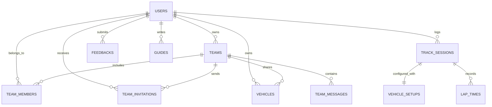

# MyLapLog - 통합 개발 기획 및 v0.8.5 구현 명세서 (App Specifications & Dev Report)

## 1. 프로젝트 및 릴리즈 개요 (Project & Release Overview)

### (1) 서비스 개요 (Service Overview)
- **서비스명**: **MyLapLog (마이랩로그)**
- **서비스 목적**: 서킷 트랙데이 및 모터스포츠 레이스 드라이버를 위한 **팀/드라이버/차량 등록, 세션별 4륜 머신 셋업 로깅, 실시간 GPS 랩 타이머, 팀원 간 셋업 데이터 및 텔레메트리 공유, 인사이트 지식 허브 및 커뮤니티 피드백 플랫폼**
- **호스팅 도메인**: 
  - 메인 접속 도메인: `https://mylaplog.com`, `https://www.mylaplog.com`, `https://app.mylaplog.com` (접속 시 `https://mylaplog.com/app/`로 단일 라우팅)
- **서버 인프라**: AWS Lightsail Debian 12 LAMP (Apache 2.4, MariaDB 10.11, PHP 8.2+)

### (2) 릴리즈 정보 (Release Info)
- **릴리즈 버전**: `v0.8.5 (Integrated Telemetry & Live Platform Release)`
- **최종 수정일자**: 2026-09-09
- **개발 산출물 경로**:
  - **웹 앱 포털**: [html/mylaplog/app/index.html](file:///c:/Users/tiziy/Documents/Antigravity/lightsail_lamp/html/mylaplog/app/index.html) (`https://mylaplog.com/app/`)
  - **관리자 컨트롤 센터**: [html/mylaplog/app/admin.html](file:///c:/Users/tiziy/Documents/Antigravity/lightsail_lamp/html/mylaplog/app/admin.html) (`https://mylaplog.com/app/admin.html`)
  - **백엔드 REST API**: [html/mylaplog/app/api.php](file:///c:/Users/tiziy/Documents/Antigravity/lightsail_lamp/html/mylaplog/app/api.php) (`https://mylaplog.com/api/*`)
  - **개인정보처리방침**: [html/mylaplog/app/privacy.html](file:///c:/Users/tiziy/Documents/Antigravity/lightsail_lamp/html/mylaplog/app/privacy.html)
  - **계정 삭제 안내**: [html/mylaplog/app/delete-account.html](file:///c:/Users/tiziy/Documents/Antigravity/lightsail_lamp/html/mylaplog/app/delete-account.html)
  - **통합 명세 문서**: [mylaplog_app_spec_dev_v0.8.md](file:///c:/Users/tiziy/Documents/Antigravity/lightsail_lamp/mylaplog_app_spec_dev_v0.8.md)

---

## 2. 개발 아키텍처 및 디자인 시스템 (Architecture & Design)

```
[ Layout Structure ]
┌─────────────────┬────────────────────────────────────────────────────────┐
│  Sidebar        │  Topbar (Page Title, Language Selector, Action Modals) │
│  - Logo         │  [ 팀 등록 | 팀 가입 | 머신 등록 | 세션 로깅 | 로그인 ] │
│  - Team Switch  ├────────────────────────────────────────────────────────┤
│  - 8 Main Tabs  │  Active Tab Panel                                      │
│  - User Profile │  [Dashboard | Sessions | Garage | Analytics |          │
│                 │   Leaderboard | Timer | Guides | Feedback]             │
│                 ├────────────────────────────────────────────────────────┤
│                 │  Mobile Bottom Nav (Home, Log, Timer, Insights, Menu)  │
└─────────────────┴────────────────────────────────────────────────────────┘
```

- **프론트엔드 스택**:
  - **Core**: Vanilla HTML5 + Modern ES6+ JavaScript (Single Page Application 구조)
  - **Styling**: Vanilla CSS3 (Custom Design System, High-Contrast Racing Dark Theme, Glassmorphism)
  - **시각화 엔진**: Chart.js (텔레메트리 셋업 vs 랩타임 상관관계 다이내믹 차트)
  - **아이콘 시스템**: Lucide Icons
  - **타이포그래피**: Google Fonts (`Chakra Petch`, `Orbitron`, `Noto Sans KR`)
  - **다국어 엔진**: Google Translate API 연동 (한국어 / 영어 실시간 전환)
- **데이터 스토리지 아키텍처 (100% MariaDB Backend + Guest Client-Memory Sandbox)**:
  - **MariaDB 10.11 REST API**: 모든 엔드포인트(`/api/*`)를 통해 유저 인증, 팀, 차량, 세션, 4륜 셋업, 랩타임, GPS 로그, 인사이트, 피드백을 실시간 저장 및 쿼리
  - **게스트 모드 (비로그인)**: 별도 로그인 없이도 모든 기능(머신 등록, 셋업 로깅, GPS 타이머, 텔레메트리 분석, 인사이트 열람)을 테스트할 수 있도록 클라이언트 메모리 기반 샌드박스 완벽 지원
  - **인사이트 & 피드백**: 게스트와 회원 모두 실제 MariaDB의 최신 데이터를 실시간 조회 및 상호작용

---

## 3. 핵심 기능 요구사항 및 프로세스 (Core Features & Flow)

```
[ 팀 구성 / 초대 ] ──> [ 머신 등록 ] ──> [ GPS 타이머 실시간 주행 ] ──> [ 4륜 셋업 로깅 ] ──> [ 텔레메트리 분석 ]
                                                      │                                  │
                                                      └──> [ 팀 실시간 채팅 공유 ]        └──> [ 인사이트 가이드 학습 ]
```

### (1) 유저 & 드라이버 및 팀 관리 (`Auth & Team Hub`)
- **이메일 및 카카오 소셜 로그인**: 이메일/비밀번호 인증 및 카카오 OAuth 2.0 간편 로그인 연동
- **드라이버 프로필**: 드라이버 클래스(`VIP Driver`), KARA 라이선스 등급, 소속 팀, 차량/세션 통계 관리
- **다중 팀 관리**: 유저당 최대 10개 팀 생성/가입, 고유 초대 코드(`APEX-KOR-2026`) 발급, 팀원 역할(`CHIEF`, `ADMIN`, `DRIVER`, `MECHANIC`, `VIEWER`) 및 권한 관리

### (2) 개러지 차량 관리 (`Garage`)
- 제조사, 모델명, 연식, 엔진 최고출력(hp), 장착 타이어 규격(F/R), 서스펜션 사양 등록
- 팀 소속 및 공개 범위(`TEAM`, `PUBLIC`, `PRIVATE`) 태그 관리
- 주행 기록이 연결된 차량의 무결성 보호(선행 세션 삭제 또는 변경 알림)

### (3) 4륜 정밀 머신 셋업 로거 (`Sessions / Setup Logger`)
- **서킷 및 환경**: 전국 4대 서킷, 주행 일자, 기온(°C), 노면온도(°C), 노면 상태(`DRY`/`DAMP`/`WET`)
- **4륜 타이어 공기압**: FL / FR / RL / RR 개별 냉간(Cold PSI) 및 피트인 직후 열간(Hot PSI) 관리
- **4륜 휠 얼라인먼트**: FL/FR/RL/RR 캠버(°), 토우(mm/°), 전륜 캐스터(°) 4륜 독립 등록
- **섀시 & 서스펜션 & 에어로**: 댐퍼 감쇠력(Front/Rear Clicks), 리어 윙 각도(°), 연료 탑재량(L)
- **최고속도 및 드라이버 피드백**: `top_speed_kmh`, `driver_notes`

### (4) ⏱️ 실시간 GPS 랩 타이머 (`GPS Lap Timer`)
- 브라우저 고정밀 Geolocation API 기반 서킷 Start/Finish 라인 및 3개 섹터 실시간 감지
- 국내 4대 서킷 결승선 좌표 지오펜스 내장, 현재 랩 / 베스트 랩 / 실시간 델타 HUD 시각화
- **실시간 WGS84 좌표 & 360° 진행방향 인디케이터**: 고정밀 위도/경도 실시간 표기 및 16방위 텍스트와 회전 나침반 바늘(Compass Dial) 연동
- 주행 완료 즉시 세션 로거(`Sessions`)로 원클릭 저장 연동

### (5) 🛑 VBOX 규격 GPS 피트레인 타이머 (`VBOX Pit Lane Timer`)
- **듀얼 게이트 지오펜스**: 피트 진입선(Pit Entry) 및 피트 출구선(Pit Exit) 통과 자동 감지
- **피트레인 속도 감시**: 규정 속도(40/50/60/80 km/h) 실시간 감시, 초과 시 시각적 RED 점멸 + 오디오 사이렌 경고
- **정차 시간 & 릴리즈 카운트다운**: 피트 박스 정차(속도 < 2.5 km/h) 감지, 의무 피트(60s/75s/5분)/정차(30s/45s) 규정시간 대비 3-2-1 비프 카운트다운 및 녹색 GO 릴리즈 차임
- **피트스탑 이력 및 델타 분석**: 총 피트 통과시간, 순수 정차시간, 피트 최고속도, 규정 충족 델타(+/-) 실시간 분석 (피트 초기화 시 이전 기록 전체 초기화)
- **가상 피트스탑 시뮬레이션**: 실내에서도 진입 -> 정차(12s) -> 릴리즈 -> 출구 풀 사이클 테스트 지원

### (6) 📖 인사이트 & 텔레메트리 가이드 (`Insights & Guides`)
- 서킷 공략, 셋업 노하우, 타이어/공기압, 레이싱 철학 등 카테고리별 전문 가이드
- MariaDB `guides` 테이블 기반 실시간 렌더링, 추천(Featured) 배너, 조회수 카운트, 마크다운 리더

### (6) 💬 팀 실시간 채팅 & 초대 (`Team Chat & Invitations`)
- 팀원 간 실시간 메시지 송수신 및 엔지니어링 피드백 공유
- 회원 검색 및 초대장 발송 / 수락 / 거절 워크플로우

### (7) 💡 기능 제안 및 커뮤니티 피드백 (`Feedback Hub`)
- 기능 제안, 버그 제보, 유저 공감(Upvote) 투표 시스템
- 관리자 상태 변경(`PENDING`, `IN_REVIEW`, `PLANNED`, `RESOLVED`) 및 공식 답변 연동

### (8) 🛠️ 관리자 컨트롤 센터 (`Admin Control Center - admin.html`)
- 마스터 키 인증 및 관리자 보안 세션
- 회원/팀 관리, 피드백 상태 관리, 인사이트 CMS 마크다운 에디터, DB 실시간 지표 대시보드

---

## 4. 상세 화면 및 기능 명세 (Implemented Features)

### (1) 🏁 드라이버 대시보드 (`Dashboard`)
- 총 세션 수, 최근 주행 일자, 서킷별 베스트 랩타임 및 차순위 대비 랩타임 델타(`-N.NNNs`)
- 가장 빠른 기록의 베스트 세션 하이라이트 배너
- 대시보드 내 최신 인사이트 가이드 위젯 (3건 미리보기)

### (2) ⏱️ GPS 랩 타이머 (`Timer Tab`)
- **서킷 자동/수동 선택**: 인제 스피디움, 영암 KIC, 용인 스피드웨이, 태백 레이싱파크
- **실시간 HUD**: 대형 디지털 랩타임(분:초.밀리초), 현재 랩 번호, Best Lap, Last Lap
- **현재 좌표 & 진행방향 인디케이터**: WGS84 고정밀 위도/경도(소수점 6자리), 실시간 나침반(Compass Dial, 0°~359° 회전 바늘) 및 16방위 텍스트(예: 북동 (NE)) 표시
- **섹터 타임 스플릿**: S1, S2, S3 구간 통과 시 즉시 섹터 타임 기록 및 베스트 대비 델타 표시
- **가상 주행 시뮬레이션**: 실내에서도 서킷 주행 궤적, 속도, 좌표, 진행방향 변화를 100% 실시간 체험 가능
- **차량 정차 감지 및 자동 세션 저장**: 피트인 정차(3.2초) 감지 시 자동으로 주행 랩타임 기록을 세션로그 모달에 연동
- **주행 세션 저장**: 측정 완료된 랩타임 리스트를 세션 로거 모달로 자동 전송하여 원클릭 저장

### (3) 📖 인사이트 허브 (`Guides Tab & Modal`)
- **카테고리 필터**: 전체(`ALL`), 서킷 공략, 셋업 노하우, 타이어/공기압, 레이싱 철학
- **실시간 검색**: 제목, 요약문, 카테고리 키워드 실시간 필터링
- **추천 인사이트 배너**: `is_featured = 1` 아티클 상단 강조
- **마크다운 리더 모달**: 테이블, 코드블록, 인용구, 헤딩 지원 및 원클릭 URL 링크 복사(`copyCurrentGuideLink`)

### (4) 💬 팀 허브 & 라이브 채팅 (`Team Hub`)
- 소속 팀 카드 목록 (최대 10개) 및 초대 코드 원클릭 복사
- 팀 라이브 채팅창: 팀원 간 실시간 대화, 엔지니어링 코멘트 공유
- 팀원 초대 및 초대장 수락/거절 팝업

### (5) 💡 기능 제안 / 제보 (`Feedback Tab`)
- 카테고리별(기능 제안, 버그 제보, 셋업 질문, 기타) 피드백 작성
- 사용자 공감(👍 Upvote) 추천 및 실시간 카운트
- 관리자 공식 답변(`admin_response`) 배너 노출

### (6) 📱 모바일 UX & PWA 최적화
- **모바일 하단 플로팅 네비게이션**: 홈, 세션 로깅, GPS 타이머, 인사이트, 메뉴 퀵 전환
- **모바일 터치 셋업 입력**: 4륜 PSI/캠버를 2x2 차량 레이아웃으로 직관적 배치, `inputmode="decimal"` 적용
- **모달 UX**: 모바일 화면에서 하단 버튼 고정(Sticky Footer) 및 우측 스크롤바 미관 개선

---

## 5. 데이터베이스 설계 (Database Schema)



### 주요 테이블 명세

#### 1) `users` (회원 테이블)
- `id` (BIGINT PK), `email` (VARCHAR(191) UNIQUE), `password_hash` (VARCHAR(255)), `name` (VARCHAR(100)), `driver_class` (VARCHAR(50)), `is_admin` (TINYINT(1)), `kakao_id` (VARCHAR(100) UNIQUE), `created_at` (DATETIME)

#### 2) `teams` (레이싱 팀 테이블)
- `id` (BIGINT PK), `name` (VARCHAR(100)), `invite_code` (VARCHAR(32) UNIQUE), `owner_id` (BIGINT FK), `home_track` (VARCHAR(100)), `description` (TEXT), `created_at` (DATETIME)

#### 3) `team_members` (팀 소속 멤버)
- `id` (BIGINT PK), `team_id` (BIGINT FK), `user_id` (BIGINT FK), `role` (VARCHAR(20) - ADMIN, DRIVER, MECHANIC, VIEWER), `joined_at` (DATETIME)

#### 4) `team_invitations` (팀 초대 관리)
- `id` (BIGINT PK), `team_id` (BIGINT FK), `inviter_id` (BIGINT FK), `invitee_id` (BIGINT FK), `role` (VARCHAR(20)), `status` (VARCHAR(20) - PENDING, ACCEPTED, REJECTED), `created_at` (DATETIME)

#### 5) `team_messages` (팀 실시간 채팅)
- `id` (BIGINT PK), `team_id` (BIGINT FK), `user_id` (BIGINT FK), `message` (TEXT), `created_at` (DATETIME)

#### 6) `vehicles` (차량 개러지)
- `id` (BIGINT PK), `user_id` (BIGINT FK), `team_id` (BIGINT FK NULLABLE), `make` (VARCHAR(50)), `model` (VARCHAR(100)), `year` (INT), `engine_power` (INT), `tire_model` (VARCHAR(100)), `tire_size_front` / `tire_size_rear` (VARCHAR(50)), `suspension_spec` (TEXT), `visibility` (VARCHAR(20)), `is_active` (TINYINT(1))

#### 7) `track_sessions` (세션 정보)
- `id` (BIGINT PK), `user_id` (BIGINT FK), `team_id` (BIGINT FK NULLABLE), `vehicle_id` (BIGINT FK), `track_id` (INT FK), `session_date` (DATE), `session_number` (INT), `air_temp` (DECIMAL(4,1)), `track_temp` (DECIMAL(4,1)), `weather_condition` (VARCHAR(50)), `top_speed_kmh` (DECIMAL(5,1)), `best_lap_ms` (INT), `visibility` (VARCHAR(20))

#### 8) `vehicle_setups` (4륜 정밀 셋업)
- `id` (BIGINT PK), `session_id` (BIGINT FK UNIQUE), `cold_psi_fl/fr/rl/rr` (DECIMAL(4,1)), `hot_psi_fl/fr/rl/rr` (DECIMAL(4,1)), `damper_front_clicks/rear_clicks` (INT), `camber_fl/fr/rl/rr` (DECIMAL(3,1)), `toe_fl/fr/rl/rr` (DECIMAL(4,1)), `caster_fl/fr` (DECIMAL(3,1)), `wing_angle_deg` (DECIMAL(3,1)), `fuel_liters` (DECIMAL(4,1)), `driver_notes` (TEXT)

#### 9) `guides` (인사이트 & 텔레메트리 지식 가이드)
- `id` (BIGINT PK), `slug` (VARCHAR(191) UNIQUE), `title` (VARCHAR(255)), `category` (VARCHAR(50)), `excerpt` (TEXT), `content` (MEDIUMTEXT), `cover_image` (VARCHAR(500)), `author_name` (VARCHAR(100)), `read_time` (VARCHAR(20)), `status` (VARCHAR(20) - PUBLISHED, DRAFT), `views` (INT), `is_featured` (TINYINT(1)), `created_at` (DATETIME), `updated_at` (DATETIME)

#### 10) `feedbacks` (기능 제안 및 버그 제보)
- `id` (BIGINT PK), `user_id` (BIGINT FK NULLABLE), `user_name` (VARCHAR(100)), `user_email` (VARCHAR(191)), `category` (VARCHAR(50)), `title` (VARCHAR(255)), `content` (TEXT), `status` (VARCHAR(20) - PENDING, IN_REVIEW, PLANNED, RESOLVED), `priority` (VARCHAR(20)), `admin_response` (TEXT), `upvotes` (INT), `created_at` (DATETIME)

---

## 6. 인프라 및 REST API 엔드포인트 목록

| Method | Endpoint | 설명 | 인증 |
| :--- | :--- | :--- | :---: |
| `POST` | `/api/auth/login` | 이메일/비밀번호 로그인 | ❌ |
| `POST` | `/api/auth/register` | 신규 회원가입 | ❌ |
| `POST` | `/api/auth/kakao` | 카카오 소셜 로그인/가입 | ❌ |
| `GET` | `/api/auth/me` | 현재 세션 유저 정보 조회 | ❌ |
| `POST` | `/api/auth/logout` | 로그아웃 | ❌ |
| `DELETE` | `/api/auth/delete-account` | 계정 영구 삭제 (회원 탈퇴) | ✅ |
| `GET` | `/api/teams` | 내 소속 팀 목록 | ✅ |
| `POST` | `/api/teams` | 신규 팀 생성 | ✅ |
| `PUT` | `/api/teams/:id` | 팀 정보 수정 | ✅ |
| `DELETE` | `/api/teams/:id` | 팀 해체 또는 탈퇴 | ✅ |
| `GET` | `/api/teams/:id/messages` | 팀 채팅 메시지 목록 | ✅ |
| `POST` | `/api/teams/:id/messages` | 팀 채팅 메시지 전송 | ✅ |
| `POST` | `/api/teams/:id/invitations` | 팀원 초대장 발송 | ✅ |
| `GET` | `/api/invitations/received` | 내가 받은 초대장 목록 | ✅ |
| `POST` | `/api/invitations/:id/accept` | 팀 초대 수락 | ✅ |
| `POST` | `/api/invitations/:id/reject` | 팀 초대 거절 | ✅ |
| `GET` | `/api/vehicles` | 내 개러지 차량 목록 | ✅ |
| `POST` | `/api/vehicles` | 차량 등록 | ✅ |
| `PUT` | `/api/vehicles/:id` | 차량 정보 수정 | ✅ |
| `DELETE` | `/api/vehicles/:id` | 차량 삭제 (무결성 검사) | ✅ |
| `GET` | `/api/sessions` | 세션 목록 (셋업+랩타임 포함) | ✅ |
| `POST` | `/api/sessions` | 세션+4륜 셋업 등록 | ✅ |
| `PUT` | `/api/sessions/:id` | 세션+4륜 셋업 수정 | ✅ |
| `DELETE` | `/api/sessions/:id` | 세션 삭제 | ✅ |
| `GET` | `/api/tracks` | 지원 서킷 목록 | ❌ |
| `GET` | `/api/leaderboard/:trackId` | 서킷별 공식 리더보드 | ❌ |
| `GET` | `/api/guides` | 공개 인사이트 가이드 목록 | ❌ |
| `GET` | `/api/guides/:idOrSlug` | 인사이트 상세 본문 조회 (조회수 +1) | ❌ |
| `GET` | `/api/feedbacks` | 사용자 피드백 목록 | ❌ |
| `POST` | `/api/feedbacks` | 신규 피드백 등록 | ❌ |
| `POST` | `/api/feedbacks/:id/upvote` | 피드백 공감 추천 | ❌ |
| `GET` | `/api/admin/stats` | 관리자 종합 통계 | 🔒 (Admin) |
| `GET/POST/PUT/DELETE` | `/api/admin/guides/*` | 인사이트 가이드 CRUD CMS | 🔒 (Admin) |
| `GET/PUT/DELETE` | `/api/admin/feedbacks/*` | 피드백 상태 및 답변 관리 | 🔒 (Admin) |
